# 🎨 Goviya Pro | UI Design System & Architecture

This document provides a comprehensive guide to the user interface, design principles, and visual assets used in the **Goviya Pro** smart farming platform.

---

## 🎨 Visual Identity

The UI is designed around a **"Deep Nature"** theme, emphasizing professional stability and growth through a curated palette of greens and slates.

| Component | Color Hex | Description |
| :--- | :--- | :--- |
| **Primary** | `#0B2E24` | Sidebar Background, Main Headers, Primary CTA Buttons |
| **Secondary** | `#155D4E` | Navigation Hover States, Accent Icons, Confirmation Buttons |
| **Accent** | `#3CC47C` | AI Confidence Metrics, Growth Indicators, Success States |
| **Background** | `#FDFDFD` | Main Application Canvas, Page Backgrounds |
| **Card BG** | `#FFFFFF` | Metric Cards, Dashboard Modules, Input Forms |
| **Slate Text** | `#1E293B` | Main Typography (Headers, Primary Data) |
| **Dimmed Text**| `#64748B` | Secondary Labels, Sub-headers, Descriptions |

---

## 📏 Application Layout

The system uses a **Split-Panel Architecture** to ensure high-density information is accessible and uncluttered.

### 1. The Global Sidebar (`Width: 240px`)
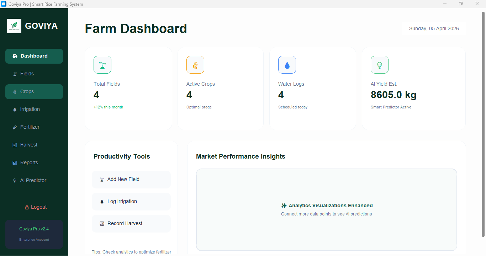
- **Branding**: Displays the "GOVIYA" logo and versioning.
- **Dynamic Navigation**: High-contrast icons with label states.
- **Session Control**: Logout and Profile settings integrated into the lower tier.

### 2. The Main Canvas (Dynamic)

- **Module Injection**: Different modules (Dashboard, Field, etc.) are injected into the canvas area based on selection.
- **Scrollable Geometry**: Uses `CTkScrollableFrame` to handle large datasets (like the field registry) without layout overflow.

---

## 🏗️ Core UI Modules & Features

### 🏢 Farm Dashboard

The primary overview module features **Metric KPI Cards**. Each card uses a three-tier layout:
- **Icon Tier**: Themed icon placeholder.
- **Data Tier**: Large bold font size for immediate visibility.
- **Trend Tier**: Micro-text showing month-over-month comparisons.

### 📋 Registry Tables (Zebra-Striped)
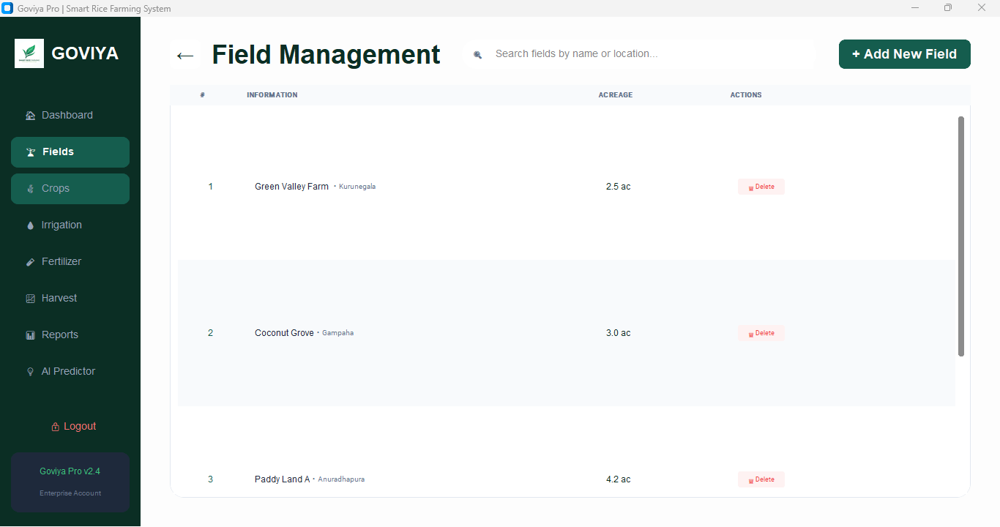
All data-heavy views (Fields, Crops, Irrigation, etc.) utilize **Zebra-Striped Tables** for readability:
- **Odd Rows**: `#FFFFFF`
- **Even Rows**: `#F8FAFC`
- **Hover Rows**: Subtle color shifts for interaction confirmation.

### 🧪 Smart Form Containers
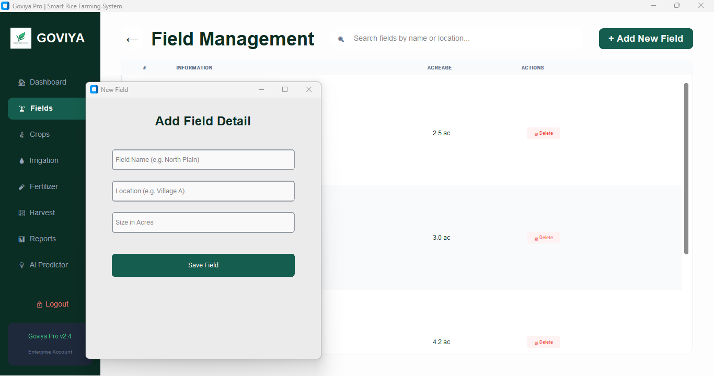
- **Multi-Input Grids**: Forms use organized grids powered by `CTkFrame`.
- **Date Pickers**: Seamlessly integrated `tkcalendar` popups for precise data entry.
- **Action Footers**: Floating "Save" or "Apply" buttons for clear user intent.

### 💡 AI Yield Forecaster Visualization
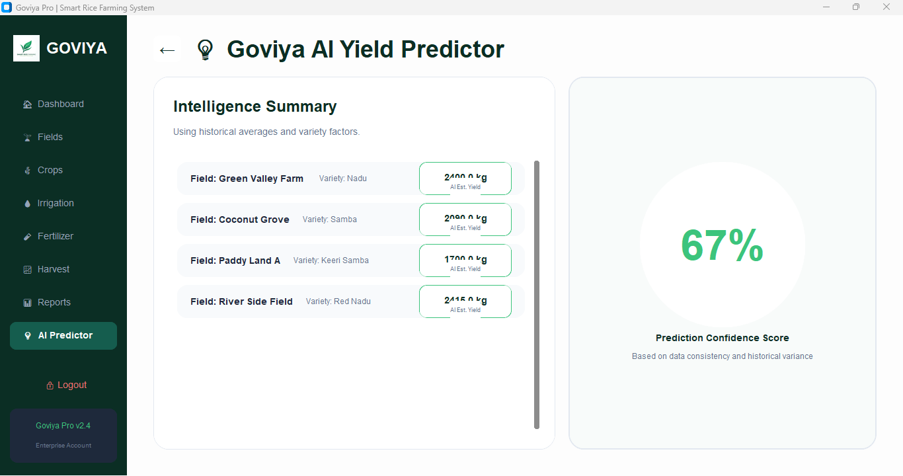
The AI section combines:
- **Detail Panels**: Textual insights with predicted yields.
- **Confidence Gauges**: Visual markers for prediction accuracy.
- **Dynamic Score Tracking**: Scores that increase as more historical data is logged via the system.

---

## 📂 Visual Asset Manifest

The following assets in the `UI/` folder define the platform's visual foundation:

| Screen | Preview | Description |
| :--- | :--- | :--- |
| **Landing** | 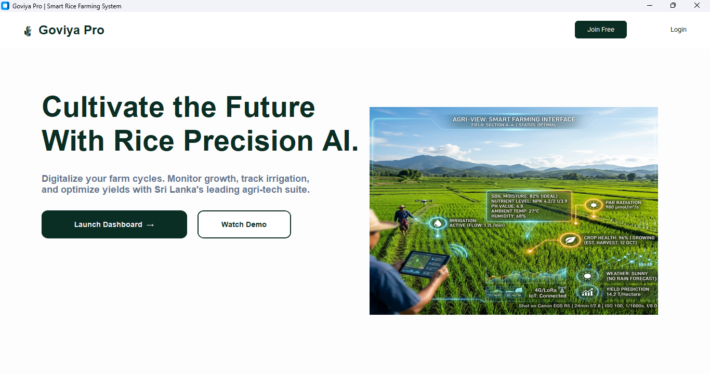 | High-fidelity reference for the entrance flow. |
| **Login** | 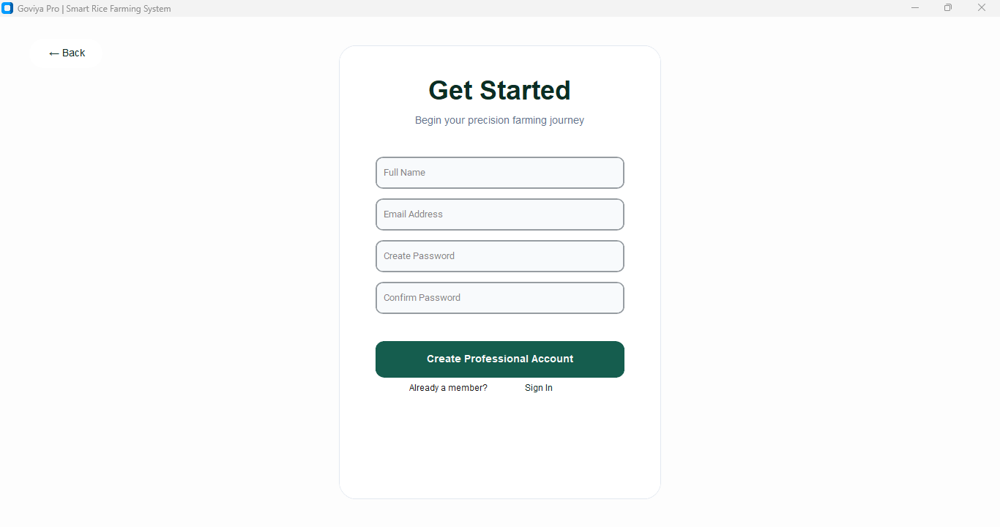 | Modern slate-themed user entry system. |
| **Registration** | 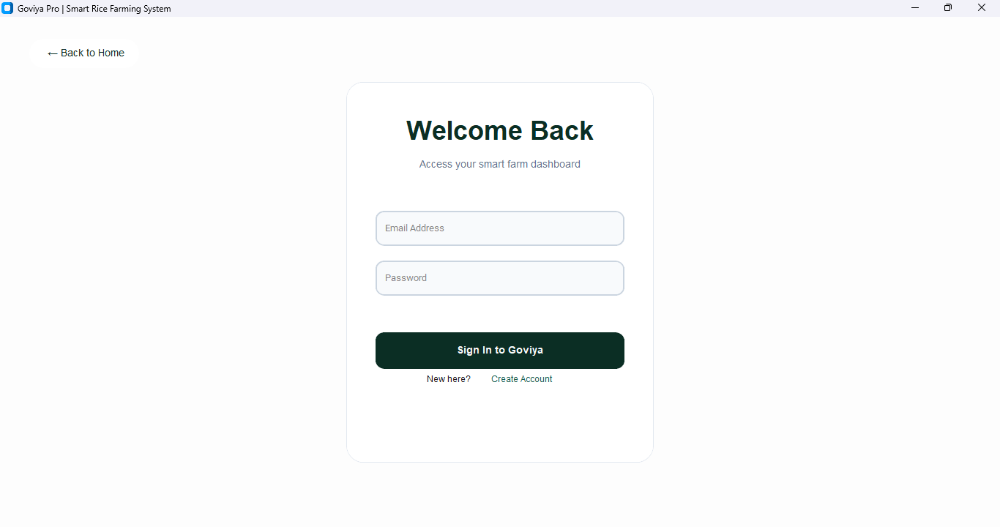 | Client registration and account setup. |
| **Dashboard** |  | Real-time farm health overview. |
| **Field Mgmt** |  | Digital field registry tracking. |
| **Crop Registry**| 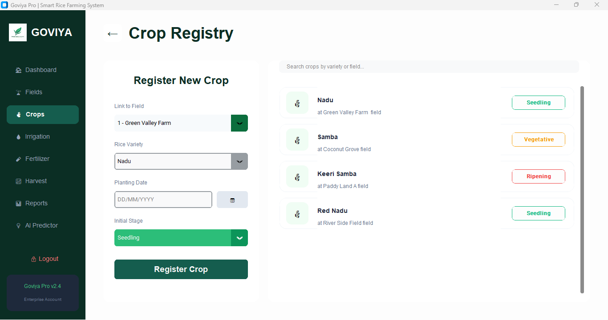 | Lifecycle monitoring for active rice varieties. |
| **Irrigation** | 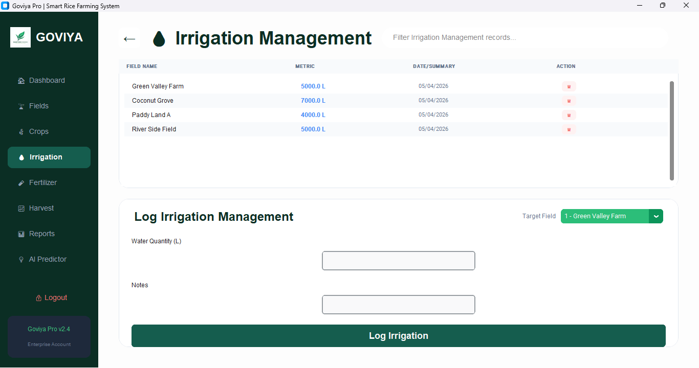 | Precision water resource tracker. |
| **Fertilizer** | 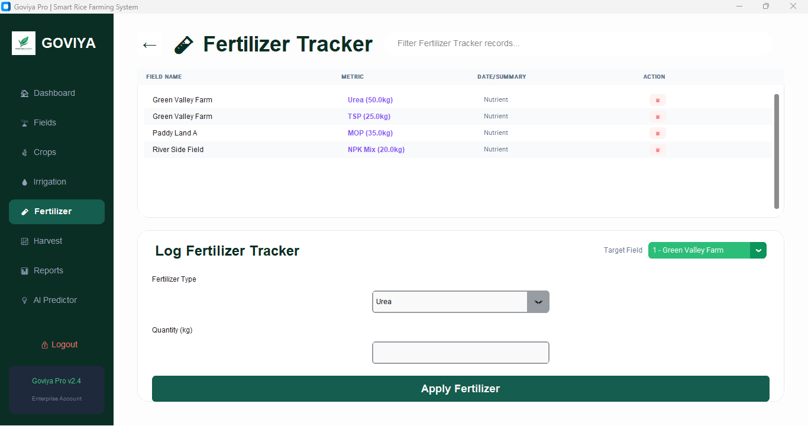 | Input logging and distribution overview. |
| **Harvest Mgmt** | 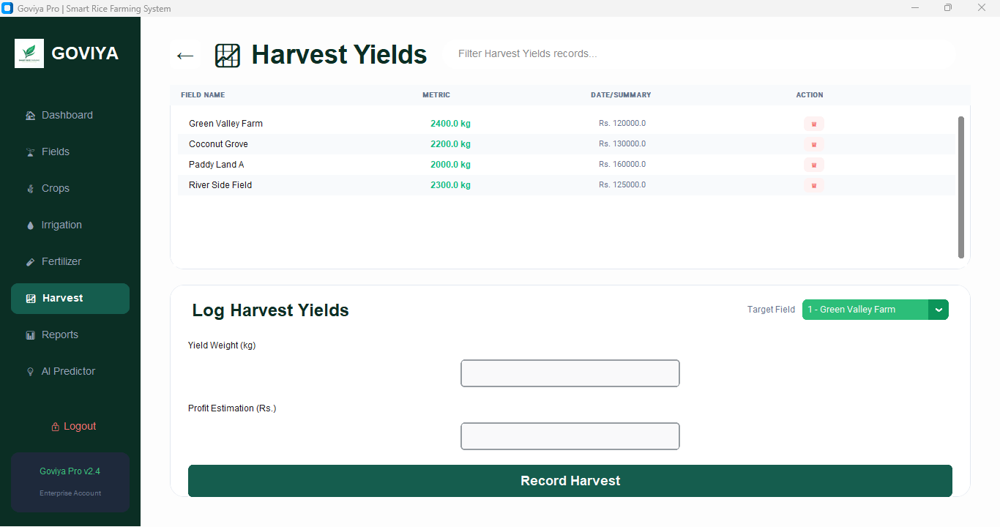 | Yield and profit estimation storage. |
| **Reports** | 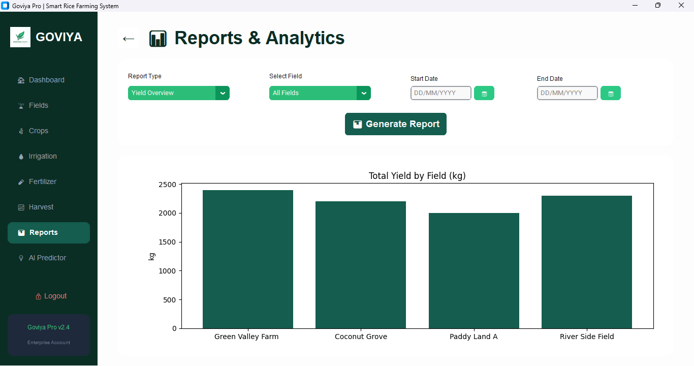 | Multi-field analytics and insights. |
| **AI Forecaster**|  | Predictive yield engine. |

---

## 🛠️ UI Tech Stack
- **Library**: `CustomTkinter` — Providing modern macOS/Windows-style UI components.
- **Graphics Framework**: `Matplotlib` — Renders real-time analytics and growth charts.
- **Image Processing**: `PIL (Pillow)` — For crisp asset rendering on high-resolution displays.
- **Typography**: Designed for **Inter** (Primary) with **System Sans-Serif** fallback.

---
*For development or design inquiries, refer to the root [README.md](../README.md).*
